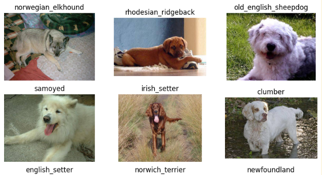
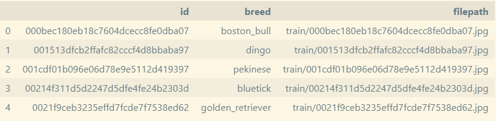
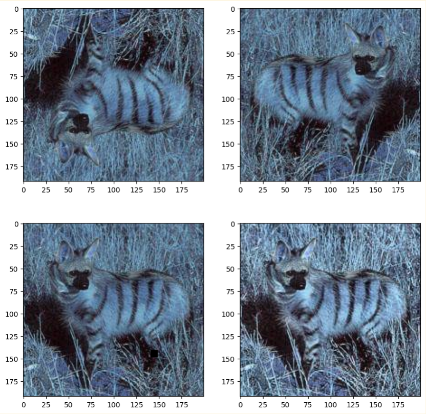
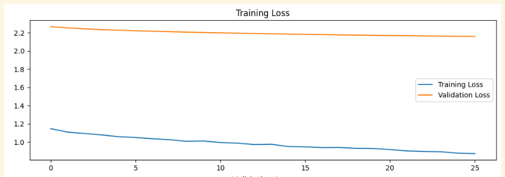
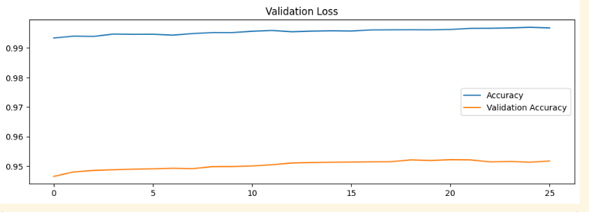

# Dog Breed Classification using Transfer Learning

## Table of Contents
1. [Introduction](#introduction)
2. [Objective](#objective)
3. [Dataset](#dataset)
4. [Methodology](#methodology)
   - [Data Preprocessing](#data-preprocessing)
   - [Transfer Learning Model](#transfer-learning-model)
   - [Training](#training)
5. [Evaluation](#evaluation)
6. [Results](#results)
7. [Conclusion](#conclusion)
8. [Future Work](#future-work)
9. [References](#references)

---

## Introduction
The **Dog Breed Classification** project aims to classify images of dogs into their respective breeds using **Transfer Learning**. With over 300 distinct breeds, this is a challenging problem due to the visual similarity between some breeds. Transfer learning allows us to leverage pre-trained models, reducing training time and improving accuracy, especially when dealing with a large dataset.

## Objective
The primary objective of this project is to build a machine learning model capable of accurately classifying dog breeds based on images. The model should:
- Achieve high accuracy in predicting the correct dog breed.
- Utilize a pre-trained model to reduce training time and computational resources.

## Dataset
The dataset used for this project comes from the **Kaggle Dog Breed Identification** competition. It contains:
- **Images**: High-resolution images of dogs from various breeds.

- **Labels**: A breed identifier for each image.

**Dataset Details**:
- Number of classes: 120 dog breeds.
- Number of images: ~10,000 training images.
- Image dimensions: Variable.

**Link to the dataset**: [Kaggle Dog Breed Identification Dataset](https://www.kaggle.com/c/dog-breed-identification/data)

## Methodology
The project employs **Transfer Learning**, using pre-trained model **InceptionV3**, fine-tuned to classify dog breeds.

### Data Preprocessing
- **Resizing**: All images are resized to a uniform size to ensure consistency.
- **Normalization**: Pixel values are normalized to [0, 1] for better convergence during training.
- **Data Augmentation**: Techniques such as rotation, zooming, and flipping are applied to improve model robustness.

### Transfer Learning Model
A pre-trained model is used for feature extraction. The steps include:
1. **Choosing a Pre-trained Model**: I used model **InceptionV3**.
2. **Freezing Early Layers**: The initial layers of the pre-trained model are frozen, as they contain generic image features.
3. **Custom Classification Head**: A custom classification layer is added on top of the pre-trained model to classify 120 dog breeds.

### Training
- **Optimizer**: Adam optimizer is used for its adaptive learning rate properties.
- **Loss Function**: Categorical cross-entropy is used, given that this is a multi-class classification problem.
- **Learning Rate Schedule**: A learning rate schedule is implemented to adjust the learning rate during training.
- **Early Stopping**: Early stopping is applied to prevent overfitting.

## Evaluation
The model performance is evaluated using:
- **Accuracy**: The percentage of correct predictions.
- **Confusion Matrix**: Visualizing the model’s performance across different breeds.
- **Precision,  Val_loss, Val_auc**: To measure the classification performance beyond accuracy.

## Results
The final model achieves an accuracy on the validation set. The model is able to distinguish between most dog breeds with reasonable accuracy, although some visually similar breeds present challenges.

## Conclusion
The use of **Transfer Learning** significantly improves training time and performance in dog breed classification. The model achieves promising results, but further fine-tuning and augmentation could improve accuracy on similar-looking breeds.

## Future Work
- Explore more advanced architectures like **EfficientNet**.
- Implement further data augmentation techniques to improve model generalization.
- Test on larger and more diverse datasets to assess robustness.
